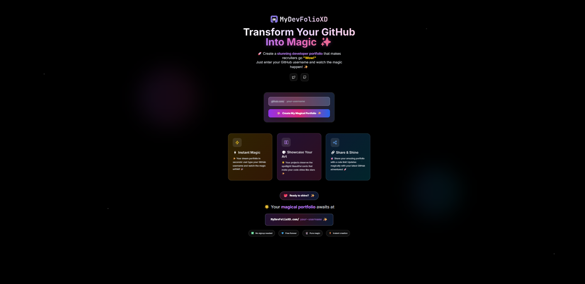

# MyDevFolioXD - AI-Powered Developer Portfolio Platform

[](https://my-dev-folio-xd.vercel.app/)
[](https://github.com/CodewithEvilxd/MyDevFolioXD)
[](https://github.com/CodewithEvilxd/MyDevFolioXD/blob/main/LICENSE)



> Transform your GitHub profile into a stunning, interactive portfolio with AI-powered insights, career guidance, and project recommendations.

## 🌟 Features

### 🤖 AI-Powered Components

#### **AI Career Path Predictor**
- **Personalized Career Recommendations**: AI analyzes your GitHub profile to suggest optimal career paths
- **Skill Gap Analysis**: Identifies missing skills and provides learning resources
- **Market Trend Integration**: Considers current industry demands and salary expectations
- **Real-time GitHub Data**: Fetches live repository data for accurate analysis

#### **AI Code Dream Generator**
- **Innovative Project Ideas**: Generates creative project concepts based on your coding style
- **Personalized Recommendations**: Tailored to your languages, frameworks, and interests
- **Code Snippets**: Includes sample code for each dream project
- **Complexity Assessment**: Matches project difficulty to your experience level

#### **AI-Powered Code Review Assistant**
- **Automated Code Analysis**: Intelligent detection of security vulnerabilities, performance issues, and best practices
- **Repository-wide Scanning**: Analyzes multiple repositories for comprehensive insights
- **Confidence Scoring**: Each issue includes AI confidence levels
- **Actionable Recommendations**: Specific fixes and improvement suggestions

#### **Smart Project Recommendation Engine**
- **Personalized Suggestions**: Recommends open-source projects perfect for your skill set
- **Real GitHub Integration**: Fetches trending repositories and analyzes contribution opportunities
- **Skill Matching**: Calculates match scores based on your languages and topics
- **Learning Pathways**: Identifies skill gaps and suggests improvement areas

#### **Neural Code Dream Weaver**
- **Visual Dream Patterns**: Canvas-based visualizations representing your coding subconscious
- **AI-Enhanced Patterns**: Uses AI to create unique dream patterns based on your profile
- **Real-time Animations**: Interactive visualizations with customizable parameters
- **Pattern Interpretation**: Explains what each dream pattern represents about your coding style

#### **AI Portfolio Assistant**
- **Conversational AI**: Chat interface powered by multiple AI providers (OpenAI, Gemini, OpenRouter)
- **Context-Aware Responses**: Understands your portfolio and provides relevant advice
- **Real-time Support**: Instant answers about features, customization, and best practices
- **Multi-Provider Fallback**: Automatically switches between AI services for reliability

### 📊 Analytics & Insights

#### **Comprehensive GitHub Analysis**
- **Repository Statistics**: Stars, forks, languages, and activity patterns
- **Language Proficiency**: Detailed breakdown of your programming languages
- **Contribution Tracking**: Commit patterns and project engagement metrics
- **Trend Analysis**: Growth patterns and development consistency

#### **Interactive Visualizations**
- **Technology Stack Charts**: Visual representation of your tech expertise
- **Activity Heatmaps**: GitHub-style contribution graphs
- **Skill Progress Tracking**: Visual skill gap analysis
- **Project Impact Metrics**: Quantified project success indicators

### 🎵 Advanced Music Player

#### **Spotify-Like Music Experience**
- **Intelligent Song Search**: Search across millions of songs using JioSaavn API
- **Smart Recommendations**: AI-powered similar song discovery based on genre, mood, and artist
- **Unlimited Playback**: Dynamic playlist expansion prevents looping (no more 4-song repeats)
- **Random Selection**: True shuffle mode with intelligent song variety
- **Genre/Mood Detection**: Automatic categorization (Romantic, Dance, Sad, Lo-fi, etc.)

#### **Comprehensive Playback Controls**
- **Shuffle Mode**: Random song selection with smart filtering
- **Repeat Options**: Off, One (repeat current), All (repeat playlist)
- **Auto-Play**: Seamless continuation with similar songs
- **Volume Control**: Precise volume adjustment with visual feedback
- **Progress Tracking**: Click-to-seek with real-time progress updates

#### **Advanced Playlist Management**
- **Dynamic Playlists**: Auto-expanding with 50+ similar songs
- **Queue System**: Add songs to play next with visual queue management
- **Favorites**: Save and organize favorite tracks
- **Recently Played**: Quick access to recently listened songs
- **Search History**: Persistent search history with quick access

#### **Full-Featured Interface**
- **Full-Screen Mode**: Immersive playback experience
- **Mini Player**: Floating button for quick access
- **Keyboard Shortcuts**: Ctrl+arrows for navigation, Space for play/pause
- **Responsive Design**: Optimized for mobile and desktop
- **Visual Feedback**: Smooth animations and loading states

#### **Smart Audio Features**
- **Crossfade Support**: Smooth transitions between songs
- **Quality Selection**: Multiple audio quality options
- **Offline Caching**: Cache songs for offline playback
- **Background Playback**: Continue playing while browsing
- **Error Recovery**: Automatic retry on playback failures

### 🎨 Customization & Themes

#### **Advanced Theming System**
- **CSS Variables**: Fully customizable color schemes
- **Dark/Light Mode**: Automatic theme switching
- **Custom Gradients**: Personalized color combinations
- **Responsive Design**: Mobile-first approach with adaptive layouts

#### **Component Library**
- **Modular Architecture**: Reusable, well-documented components
- **Animation System**: Smooth transitions and micro-interactions
- **Accessibility**: WCAG compliant with screen reader support
- **Performance Optimized**: Lazy loading and code splitting

### 🚀 Developer Experience

#### **Modern Tech Stack**
- **Next.js 14**: App Router with server components
- **TypeScript**: Full type safety and IntelliSense
- **Tailwind CSS**: Utility-first styling with custom design system
- **Framer Motion**: Smooth animations and transitions

#### **AI Integration**
- **Multi-Provider Support**: OpenRouter, Gemini, and OpenAI integration
- **Fallback System**: Automatic switching between AI services
- **Error Handling**: Graceful degradation when AI services are unavailable
- **Rate Limiting**: Smart API usage management

## 🛠️ Installation & Setup

### Prerequisites
- Node.js 18+
- npm or yarn
- GitHub account (for API access)

### Quick Start

1. **Clone the repository**
   ```bash
   git clone https://github.com/CodewithEvilxd/MyDevFolioXD.git
   cd MyDevFolioXD
   ```

2. **Install dependencies**
   ```bash
   npm install
   ```

3. **Environment Setup**
   ```bash
   cp .env.example .env.local
   ```

   Configure your environment variables:
   ```env
   # GitHub API (Required)
   NEXT_PUBLIC_GITHUB_ACCESS_TOKEN=your_github_token

   # AI Providers (Optional - at least one required)
   NEXT_PUBLIC_OPENROUTER_API_KEY=your_openrouter_key
   NEXT_PUBLIC_GEMINI_API_KEY=your_gemini_key
   ```

4. **Run the development server**
   ```bash
   npm run dev
   ```

5. **Open your browser**
   ```
   http://localhost:3000
   ```

### Environment Variables

| Variable | Description | Required |
|----------|-------------|----------|
| `NEXT_PUBLIC_GITHUB_ACCESS_TOKEN` | GitHub API access token | Yes |
| `NEXT_PUBLIC_OPENROUTER_API_KEY` | OpenRouter API key | No* |
| `NEXT_PUBLIC_GEMINI_API_KEY` | Google Gemini API key | No* |

*At least one AI provider key is required for full functionality

## 📁 Project Structure

```
MyDevFolioXD/
├── app/                          # Next.js App Router
│   ├── [username]/              # Dynamic user pages
│   ├── api/                     # API routes
│   │   └── chat/               # AI chat API endpoint
│   └── globals.css              # Global styles
├── components/                  # React components
│   ├── ai/                     # AI-powered components
│   │   ├── AICareerPathPredictor.tsx
│   │   ├── AICodeDreamGenerator.tsx
│   │   ├── AIPoweredCodeReviewAssistant.tsx
│   │   ├── SmartProjectRecommendationEngine.tsx
│   │   ├── NeuralCodeDreamWeaver.tsx
│   │   ├── AIPortfolioAssistant.tsx
│   │   └── index.ts
│   ├── analytics/              # Analytics components
│   ├── ui/                     # UI components
│   │   ├── MusicPlayer.tsx    # Advanced music player component
│   │   ├── VisitorCounter.tsx  # Visitor tracking component
│   │   └── ThemeToggle.tsx    # Theme switching component
│   └── visualizations/         # Data visualization
├── lib/                        # Utility libraries
│   ├── aiService.ts            # AI service integration
│   ├── githubService.ts        # GitHub API client
│   └── theme.ts                # Theme configuration
├── types/                      # TypeScript definitions
│   └── index.ts                # Type definitions
└── public/                     # Static assets
    ├── folio.png              # Main project logo
    └── mydevfolio.png         # Alternative logo
```

## 🎯 Usage

### Basic Usage
1. Visit the [live demo](https://my-dev-folio-xd.vercel.app/) or run locally at `http://localhost:3000`
2. Enter a GitHub username
3. Explore the AI-powered insights and recommendations

### Advanced Features
- **AI Chat**: Click the floating AI assistant for instant help
- **Code Reviews**: Navigate to repositories for automated analysis
- **Career Planning**: Use the career predictor for personalized guidance
- **Project Ideas**: Generate innovative project concepts
- **Dream Weaver**: Visualize your coding subconscious with AI
- **Smart Recommendations**: Get personalized project suggestions
- **Music Player**: Access the floating music player for unlimited streaming
- **Song Discovery**: Search and discover new music with intelligent recommendations

### Screenshots & Demo

The application includes several key interfaces:
- **Main Dashboard**: Overview of GitHub profile analytics
- **AI Career Predictor**: Personalized career path recommendations
- **Code Dream Generator**: Innovative project idea generation
- **Code Review Assistant**: Automated code analysis and suggestions
- **Neural Dream Weaver**: Visual coding subconscious representations
- **AI Chat Assistant**: Conversational AI support
- **Advanced Music Player**: Spotify-like music streaming with intelligent recommendations

## 🤝 Contributing

We welcome contributions! Please see our [Contributing Guide](CONTRIBUTING.md) for details.

### Development Workflow
1. Fork the repository
2. Create a feature branch
3. Make your changes
4. Add tests if applicable
5. Submit a pull request

## 📄 License

This project is licensed under the MIT License - see the [LICENSE](LICENSE.md) file for details.

## 🙏 Acknowledgments

- **GitHub API**: For providing comprehensive developer data
- **OpenRouter**: For AI model access and orchestration
- **Google Gemini**: For advanced AI capabilities
- **Vercel**: For hosting and deployment
- **Framer Motion**: For smooth animations
- **Tailwind CSS**: For utility-first styling

## 🌐 Live Demo

**Try GitHubFolioXD live:** [https://my-dev-folio-xd.vercel.app/](https://my-dev-folio-xd.vercel.app/)

## 📞 Support

- **Repository**: [GitHub](https://github.com/CodewithEvilxd/MyDevFolioXD)
- **Issues**: [GitHub Issues](https://github.com/CodewithEvilxd/MyDevFolioXD/issues)
- **Discussions**: [GitHub Discussions](https://github.com/CodewithEvilxd/MyDevFolioXD/discussions)
- **Documentation**: [Wiki](https://github.com/CodewithEvilxd/MyDevFolioXD/wiki)

## 🚀 Roadmap

### Upcoming Features
- [ ] **Collaborative Features**: Team portfolio sharing
- [ ] **Advanced Analytics**: Machine learning-driven insights
- [ ] **Mobile App**: React Native companion app
- [ ] **Plugin System**: Extensible component architecture
- [ ] **Multi-language Support**: Internationalization
- [ ] **Integration APIs**: Third-party service connections

### Version History
- **v1.0.0**: Initial release with core AI features
- **v1.1.0**: Enhanced visualizations and performance
- **v1.2.0**: Multi-provider AI support and improved UX
- **v1.3.0**: Advanced Music Player with Spotify-like features and unlimited playback

---

**Built with ❤️ for developers, by RAj**

Transform your GitHub presence into a powerful career asset with AI-powered insights and recommendations.
